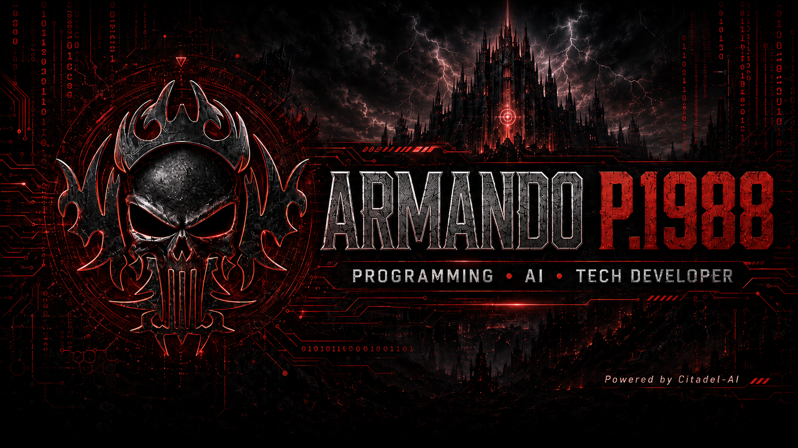
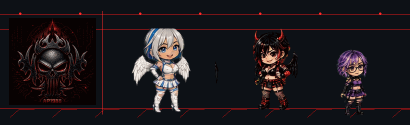
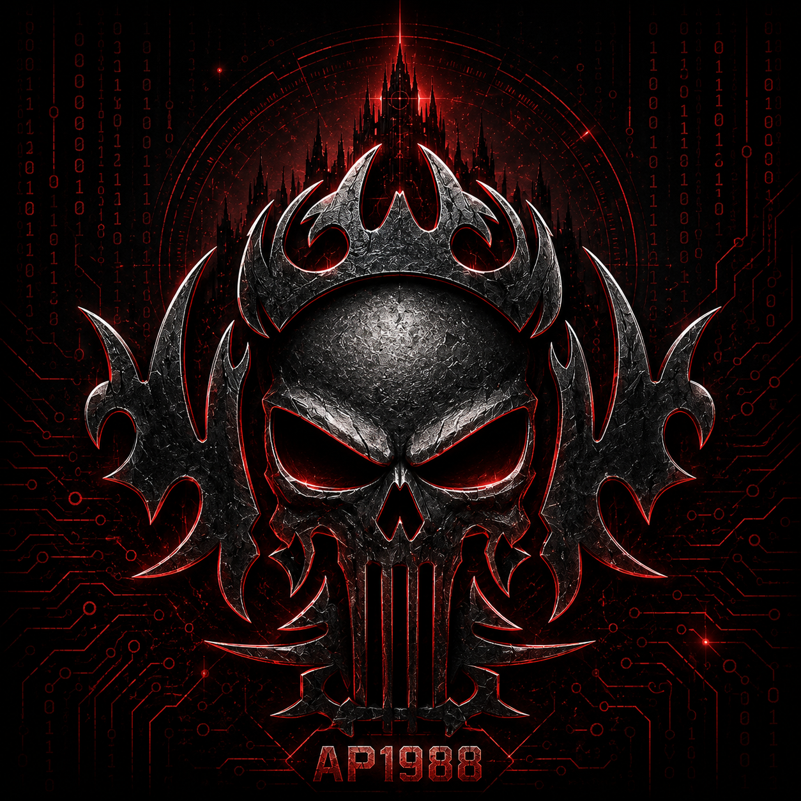

  

<h1 align="center">Armando P.1988</h1>

<b>Computer Programming Student • AI Builder • Security/Dev Toolmaker</b>

  
  
  
  

---

## 👋 About me

I'm a full-time Computer Programming student building practical software, security tooling, AI-assisted workflows, and cross-platform experiments. I learn best by building real things, breaking them safely, documenting what happened, and making the next version less likely to explode.

- 🛡️ Building security-focused tools with verification-first, zero-trust ideas
- 🤖 Developing **Citadel-AI** experiments and companion workflows
- 🧰 Publishing free, open-source **Practical ChatGPT Skills**
- 🐧 Daily-driving Linux while also building for Windows
- 📚 Still learning — aggressively

---

## 🪽 The Citadel crew

  

<b>Spunky • Codex • Spicy</b>

  
<b>🚨 Panic Button</b>

   
  
   
  <i>Everything is fine. The fires disagree.</i>

---

## 🚀 Featured work

### 🧩 Practical ChatGPT Skills
Free, open-source Skills for safer development, debugging, Git, architecture, security, and system administration.

---

## 🧰 Tech I'm working with

  
  
  
  
  
  
  
  

---

## 🌐 Find me

  

<i>Build it. Test it. Verify it. Commit it.</i>

